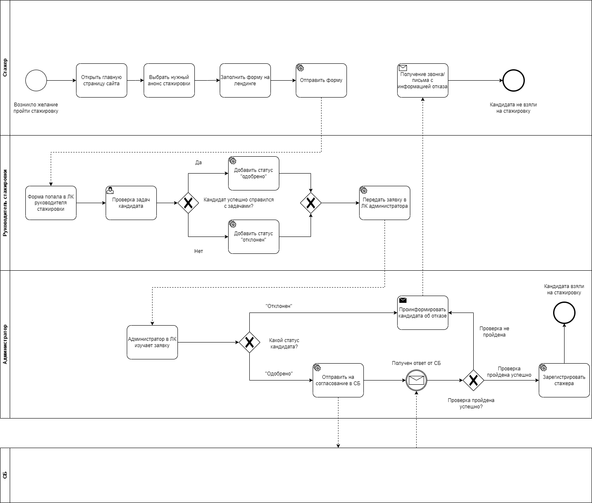
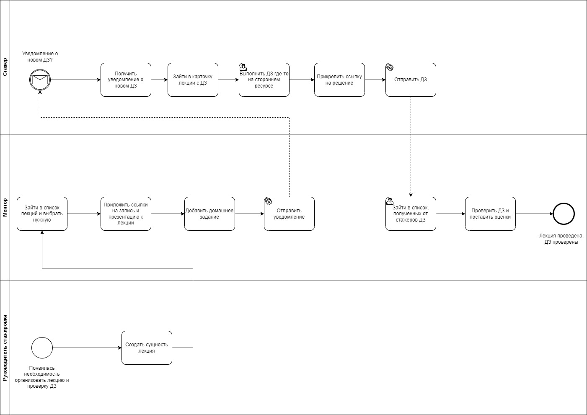
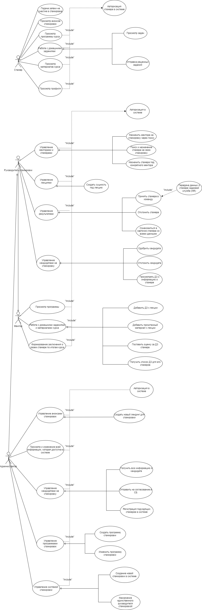

# Техническое задание, Октябрь - Ноябрь 2023

- [Добро пожаловать](#Добро-пожаловать)  
- [Бизнес-кейс](#Бизнес-кейс)  
- [Системные требования](#Системные-требования)  
    - [Функциональные требования](#Функциональные-требования)
    - [Архитектурно значимые требования](#Архитектурно-значимые-требования)
    - [Ограничения](#Ограничения)
- [Диаграммы бизнес процессов](#Диаграммы-бизнес-процессов)  
    - [Процесс подачи и рассмотрения заявки](#Процесс-подачи-и-рассмотрения-заявки)
    - [Процесс проведения обучения](#Процесс-проведения-обучения)
- [Целевая архитектура](#Целевая-архитектура)  
    - [Диаграмма вариантов использования](#Диаграмма-вариантов-использования)  
    - [Диаграмма системного контекста](#Диаграмма-системного-контекста)
    - [ER-модель](#ER-модель) 

## Добро пожаловать

Эта страница представляет собой первую версию технического задания для Лиги Цифровой экономики.

## Бизнес-кейс

Компания активно расширяется, и её цель - в ближайшее время удвоить размер компании. В связи с этим планируется увеличить бюджет и объем практик. Однако рынок специалистов по некоторым ролям очень слаб, поэтому выгоднее инвестировать в обучение людей, чтобы достичь нужных результатов, вместо того чтобы нанимать всех сотрудников с рынка.
На данный момент проведение стажировок осуществляется в основном вручную, что занимает много времени. Также используются разрозненные инструменты, включая Google-таблицы, хотя большинство процессов в компании уже автоматизированы. 

**Движущие силы бизнеса**

Какие движущие силы бизнес-модели мы можем извлечь из сложившейся ситуации:
* Слабый рынок специалистов по отдельным позициям
* Перспектива автоматизации проверки домашних заданий
* Уменьшение затрат времени на контроль подчиненных

**Бизнес-цели**

Компания ставит перед собой следующую бизнес-цель, чтобы помочь сложившейся ситуации:

* Разработать новую систему, автоматизирующую процесс организации и проведения стажировок, которая будет соответствовать требуемым качествам.

Компания страдает от отсутствия автоматизированной системы проведения стажировок, что может привести к большим финансовым издержкам. Они хотят разработать интуитивно понятную систему, которая позволит им сократить затраты труда сотрудников и обеспечить будущий рост компании.

## Системные требования

### Заинтересованные стороны

В этом разделе описываются ключевые заинтересованные стороны системы и их архитектурные проблемы.

* **SH-1**: **Администратор**

* **SH-2**: **Заказчик** (доступность, удобный интерфейс, масштабируемость)
    - Заказчик, в качестве руководителя стажировки, хотел бы оптимизировать использование времени менторов и стажеров, предлагая проводить стажировку с использованием одного единого окна для всех операций. Это сделает проведение стажировки наиболее удобным.

* **SH-3**: **Ментор** (доступность, производительность)

* **SH-4**: **Руководитель стажировки**

* **SH-5**: **Стажер** (доступность)
    - стажеры хотят, чтобы система, к которой они обращаются, была доступна в любое время, когда они захотят ее использовать, и чтобы она быстро реагировала на их действия;

* **SH-6**: **Кандидат на стажировку** (доступность, производительность)
    - Кандидат имеет очень ограниченные права

### Функциональные требования

* **UC-1**: **Подача и рассмотрение заявки на стажировку**:
    - кандидат подает заявку путем заполнения и отправки формы через лендинг на сайте (SH-6);
    - руководитель стажировки использует свой личный кабинет (ЛК) для оценки информации о кандидате, выполненного домашнего задания и принятия решения в рамках системы – нажимает кнопку “подходит” кандидат или “отклонить” (SH-4);
    - администратор в ЛК получает отдельный список, где указаны статусы одобрено или отклонено для каждого кандидата. Если кандидат отклонен, администратор может вручную (уже не в рамках системы) связаться с ним путем написания письма или звонка, где проинформирует о том, что он не принят на стажировку.

* **UC-2**: **Регистрация профиля**:
    - Администратор имеет функционал регистрации профиля стажера, которого одобрили руководитель стажировки и СБ. Администратор в списке кандидатов выбирает нужного, нажимает кнопку “зарегистрировать”, и стажер регистрируется в системе. (SH-1);
    - Если статус от СБ “проверка не пройдена”, стажера не регистрируют (SH-1) 

* **UC-3**: **Отправить информацию о стажере в СБ**:
    - В случае, если в списке кандидатов стоит статус "одобрено" руководителем стажировки. Администратор должен отправлять информации о потенциальном стажере в СБ. Нажимает кнопку “Отправить на проверку в СБ”. Дальше возвращается статус. Если статус “проверка пройдена успешно”, администратор регистрирует кандидата (UC-2) (SH-1);

* **UC-4**: **Работа с материалами стажировки**:
    - все авторизированные участники могут просмотреть программу стажировок (SH-1, SH-2, SH-3, SH-4, SH-5);
    - стажер может отправлять домашнее задание, прикрепив ссылку на решение на стороннем ресурсе, например, Google документы (SH-5);
    - стажер может ознакомиться с материалами курса. В ЛК стажера есть список всех пройденных лекций в рамках стажировки. Он может открыть карточку каждой лекции, где будут две ссылки - одна для просмотра/скачивания видео (например, через Яндекс Диск), а вторая для просмотра/скачивания презентации (SH-5);
    - руководитель стажировки должен иметь возможность создать такую сущность “лекция” (например, “лекция 4”). Чтобы прикрепить материалы к этой сущности, и чтобы ментор мог выложить ДЗ в эту сущность. Руководитель всегда может зайти от имени ментора и выложить ДЗ (SH3, SH4);
    - ментор через ЛК должен иметь возможность через форму создать домашнее задание. Домашнее задание представляет собой текстовые поля и изображения (SH-3);
    - ментор может ознакомиться со списком лекций, а также может приложить в отдельную карточку прочитанный материал (SH-3);

* **UC-5**: **Анонсы стажировок**:
    - аминистратор может создать анонс стажировки в рамках конструктора, сверстать и опубликовать его, нажав на соответствующую кнопку. Анонс по определенной ссылке опубликуется (SH-1);
    - неавторизованные пользователи могут просмотреть анонс стажировоки (SH-1, SH-2, SH-3, SH-4, SH-5, SH-6);

* **UC-6**: **Управление стажировкой**:
    - Администратор создает программу стажировки через форму. Нужную информацию он получает от руководителя стажировки по другим каналам связи вне системы (SH-1);
    - Администратор создает новую стажировку в системе (SH-1);

* **UC-7**: **Проверка ДЗ и отчетность**:
    - У руководителя стажировки есть список стажеров, где он может в карточке стажера (нажав на конкретного стажера) ознакомиться с историчностью выполнения домашних заданий, оценками, комментариями и обратной связью от менторов (SH-4);
    - В ЛК ментора должна быть форма для написания заключения о своем стажере (SH-3);
    - В ЛК ментора должен быть доступ к списку полученных от стажеров домашних заданий, выполненных стажерами, где он сможет поставить оценку (SH-3);

* **UC-8**: **Управление стажерами и менторами**:
    - Руководитель стажировки выполняет поиск по фамилии человека из компании, которого он знает, что тот будет ментором.  При нажатии кнопки "Назначить ментора" сотрудник будет установлен в роли ментора на определенную стажировку (SH-4);
    - Руководитель стажировки имеет функцию поиска стажера, который уже присутствует в системе, и возможность назначения его на свою стажировку. За каждым стажером закрепляется только один ментор. На курсе множество менторов (SH-4);
    - Руководитель стажировки в рамках поиска может назначить стажера под конкретного ментора (SH-4);

### Архитектурно значимые требования

* **QA-1**: **масштабируемость**
    - количество стажеров - сотни?
    - количество стажировок на одного стажера <= 10 (давайте предположим что-то незначительное);

* **QA-2**: **доступность**
    - функции, ориентированные на стажера, должны быть высокодоступными, поскольку перебои в работе окажут негативное влияние на бизнес?;
    - 99,9% здесь кажутся разумными;

* **QA-3**: **производительность**
    - система будет низко-нагруженной;
    - время отклика < 2 с при загрузке страницы?;
    - время поиска пользователей составляет не дольше 500мс?;

* **QA-4**: **безопасность**
    - нужно использовать корпоративную систему авторизации для регистрации стажеров и доступа всех участников системы в личные кабинеты
    - сессия пользователя продолжает действовать до тех пор, пока токен активен;
    - автоматизировать сбор согласия на обработку персональных данных не планируется;
    - зарегистрированные аккаунты хранятся в контуре Лиги Цифровой Экономики;
    - для обращения к ЛК системы– HTTPS. Для общения внутри одного контура HTTPS необязательно. Один закрытый сегмент в системе;
    - использование библиотек, одобренных СБ;

* **QA-5**: **Интеграции**
    -Для обращения к ЛК системы– HTTPS. Для общения внутри одного контура HTTPS необязательно. Один закрытый сегмент в системе;
    - Для интеграции с СБ – брокер сообщений Kafka;
    - Для интеграции с службой HR – SOAP;
    - Использование корпоративного хранилища с зарегистрированными аккаунтами – база данных Active Directory;
    - Нужно будет описать контракты с фронтом

### Ограничения
* **CON-1**: Интеграции? Технологический стек?

## Диаграммы бизнес процессов

### Процесс подачи и рассмотрения заявки

Приведенная ниже диаграмма BPMN иллюстрирует процесс подачи и рассмотрения заявки на стажировку (UC-1):

#### Описание
Стажер заполняет анкету, и эти данные сначала попадают к руководителю стажировки. Руководитель стажировки оценивает информацию о кандидате, выполненное домашнее задание и принимает решение в рамках системы – нажимает кнопку “подходит” кандидат или “отклонить”, после чего эти данные передаются администратору стажировки. 

В ЛК администратор должен быть отдельный список, где указаны статусы одобрено или отклонено для каждого кандидата. Если кандидат отклонен, администратор может вручную (уже не в рамках системы) связаться с ним путем написания письма или звонка, где проинформирует о том, что он не принят на стажировку. В случае одобрения кандидата, администратор нажимает кнопку “ ”. Дальше возвращается статус. Если статус “проверка пройдена успешно”, администратор нажимает кнопку “зарегистрировать”, и стажер регистрируется в системе. Если статус “проверка не пройдена”, стажера не регистрируют.

### Процесс проведения обучения
На следующей диаграмме BPMN иллюстрирует процесс создания, проверки ДЗ (UC-3, UC-6):

#### Описание:

Как руководитель стажировки, он должен иметь возможность создать такую сущность “лекция". Чтобы прикрепить материалы к этой сущности, и чтобы ментор мог выложить ДЗ в эту сущность (руководитель всегда может зайти от имени ментора и выложить ДЗ).

В ЛК ментора должна быть доступна форма для создания домашнего задания, а также форма со списком лекций, чтобы можно было приложить туда прочитанный материал. Автоматически отправляется уведомление стажерам.

Стажер в ЛК увидел, что появилось задание. После чего выполняет его где-то на стороне, прикрепляет ссылку и отправляет на проверку. На первой версии после проверки ДЗ он не будет получать обратную связь в системе, обратная связь будет предоставлена ментором на лекции или другим каналом связи. Фидбэк и оценка будет доступна только в ЛК проверяющего ментора или в ЛК руководителя стажировки.

## Целевая архитектура
В этом разделе описывается целевая архитектура программного обеспечения.

Пожалуйста, обратите внимание, что все представления задокументированы в [модели C4](https://c4model.com), хотя пока представлен только системный контекст.

### Диаграмма вариантов использования
На следующей диаграмме показано сопоставление функциональных требований к акторам:

### Диаграмма системного контекста

На приведенной ниже диаграмме системного контекста изображены ключевые пользователи системы и ее внешние зависимости:

![C4 in PlantUML](http://www.plantuml.com/plantuml/png/TLHlJ_jK67tVJt7TgotviMBq5I64mXOXJfWRXFXgATl5DLlRsTuwYJ5X344Z4J4a6anKlW43fsEmxIlSVYFFiplujMkM06tly-USvppdikuBqnE1tTG-i9ngCwXnLXUYvQ_ekcUsirzQeXuS1ZxtgguZk2EoLTVMMqtJePebNzIQrg6--V5IaOxsFolejkaBxk6eieaAqtAubsrHVyrlM4xBz4oRjJspTM3LH9rzjBoi5OmlTlVtAWVRUrkLGlwJ_4ukdNazB1WxkVAcKSpZI1EMQ7ADiTNwXsloJWx2JdWg-_95thzZybu-u6jCNtWEv7-8duJTyEVmHvnSCJa9J-GuF9Tzb7MO7EFp4LKZoaN6EPu3XX-LA1_G-H_y8evgWaBol_XGmR4SPbTr424-rXmTXd0FYSHaXFSdr8FU5P5Q8O2kxCbd00u9c01MTMjDuqwDgHarhSWzttNI-r3-7Kl9lz3bERn40mA_9o3wJcMqyZ7qjYlvRqJQ34ITac-dmqtehn839IEyqHXncaeqv4L5I56Flv7og98HHIGkGr_9G7f1fJ6TOwW9GxyEWjypA7-1CiedXOUK7OCFVs9K_uUynH0btfoD-Zh3BmbcmDVnqfsMZsYiy2mguPJsht84-1y84wgNykKzPXIttykquGPEpVIEqxvx9Dgcnol-D83Q0twuDATFOkl3cJftE7qAJnc9pCf58vLXtsflVayxlEr7qyXlvBGnU7Vmze8scKZ-aUiHWpaJGTXdCkuO9qDb5wNvQ16rQ4-FLxt04ZPtnEBMw2HxoYU9tSQwrLsRjrsluI_kTID_UzFvyu07d3m96dxBTNnU-OgEKFsfUTGm8QBy7MAS4JPrKIjyxGM4Q-MA-1Y9PdGloA2WqgDAS3-b1JK811s-c_PGdafkdAu5_AJgHqdFHEzMUMCwEK2waAX7S_TGHVTnGZwdxP8ej8LetLPflcwh5CymSfHnBM_88qFoCrB9txG32f5G9FPZx28oeogihpdBMP18kDunkjAq2SLdpDN_d_2IXHUqOUBE20mx68RTcTe9ZHJzFu4_8NJo6Oq-cD-T7C2dSGlreqZbNQEu26Cg08BhtAa5TlD_)

Код диаграммы в формате plantUML:
[ERD](plantUML/C4.plantuml)

### ER-модель

На приведенной ниже диаграмме «cущность-связь» приведены ключевые сущности и атрибуты системы:

![ERD in PlantUML](http://www.plantuml.com/plantuml/svg/jLPTJXin47xVKqoVsaea1uWGeb9LgUfBUuALjJ5bHNONURrG14Zv4IrIKl7Un_O28P0IGf9UONoZZXqPlCGDKVeZLOjdlfblxFq-RxPpoOGiaaRmR5-mZmc31ZlA2WbvmYLBMH0yXpokGmLo7XKYbaSGrtaguvsO2ueMEHSKsG0SuqorwNzJTV4My0g7ECMXQk98jU5L9EC3_ZeMF9APE88NEC4PNgaEKCKvZl0I-wgjUggbBbvMWu0ODDLE9X8u3e3-qGmrY5C9cvlltsrjcHWjkKX3NwfICOyeAqJESnVona9o4pnW8jfbOeuMd4bU3vcaX8mJJeUJx0UdfNa-51IEizIToq-kqLvcoJ_9TQX3bkQ7NBpLsrwNttzkEkMGhSopfDsoRTbY_rcmd5uPwIzr4pISKSD9LgrMi-FogwZPlIvYt3DpW1iFKmUBCDl0Ksk1jjgUcPNQqyUrikuCcEovL1SiJRCYZRW-BZ-vnn2hgF9KMn-_Ov-yUKSc_enzSld0CJhEoEZgJ3K9CzKsr-u5rSA1ki0RrGESw4jW3gxWM7LKKxKsG7tH8RnKNI1e5mUqk3RrFLtzY_viKMXSggV0WFXlY6jCgo71xdIMybrrPX9WAGWxqSF_0DDvggyQd3sa2QclffRU2jwfddvwo5IdNEyYl3tS0GPbNOHpkQsb3jF0xrQNGIiW4_b_eMZmI1Q2_vt0AdE8RHPwh7yGrtaM2XvbeXusudJlKNwVPg2Hc7QzBx-R9Vmm4tlXWfZDnN1gV7roxzMQyu48RD2Ql-mi2_KWoozW5QXLmpAaFN8Nj6X9CWpWrToHnamJ705UQmTWNvtZcC0cDDBADT_ZwLpTrgV6l5C2Q-iQTzFAM8pmK-DnuxGnqOteULi5_AOTGIpzHrHbchupcRaygBF5j3H6jUsjeVSr0FMLLXsWyFqELOVgHa2yGp2_6NxgkQWLJKDcDFNbYwPgDMkri89ehI9zgfs_LKej_m6nnZVDuw_m7mrjspmzDirWoQtqVDFK7Bh0axVE-aF5Da_hHTBu3G00)

Код в формате plantUML:
[ERD](plantUML/ERD.plantuml)
